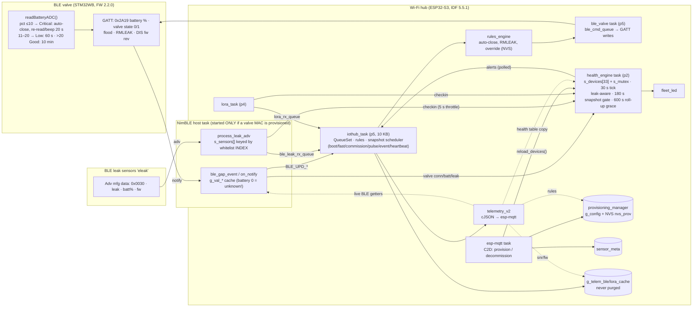

# eFloStop Wi-Fi Hub: architecture and root-cause pre-analysis for 2.1.4

**Status: verified hypotheses, re-check before acting.**

- **Hub:** `nayeemantu14/eflostop_wifihub_idf1` `master` @ **`ae4d59a`** (PROJECT_VER **2.1.3**, the firmware in the field logs). All line numbers refer to this commit. If your tree has moved on, relocate each site with the ⚓ grep anchors.
- **Valve:** `nayeemantu14/elfostop_ble_valve` @ `23f8897` (FW 2.2.0). Read-only.
- **Verdicts:** every hypothesis was checked against 2.1.3 by an independent reviewer and marked **CONFIRMED** or **CHANGED**. None was refuted.
- **Abbreviations:** A = `main/iothub/app_iothub.c`, T = `main/telemetry/telemetry_v2.c`, H = `main/health_engine/health_engine.c`, V = `main/ble_valve/app_ble_valve.c`, R = `main/rules_engine/rules_engine.c`, S = `main/ble_leak_scanner/app_ble_leak.c`.

---

## 1. System architecture (2.1.3)



**Tasks:**

| Task | Stack | Priority | Notes |
|---|---|---|---|
| iothub_task | 10240 | 5 | |
| lora_task | 10240 | 4 | |
| uart_cmd_task | 4096 | 5 | |
| uart_event_task | 4096 | 12 | |
| wifi_task | 4096 | 5 | idle loop |
| ble_valve | 4096 | 5 | |
| ble_starter | 3072 | 5 | |
| ble_leak_scan | 3072 | 4 | |
| health_engine | 3072 | 2 | |
| monitor | 3072 | 1 | core 1 |
| reset_btn | 3072 | 5 | |
| led / fleet_led | 2048 / 2560 | 1 | |

NimBLE host and esp-mqtt run as component tasks.

**Snapshot data path** (`telemetry_v2_publish_snapshot`, T:640+):
- **Health table:** copied under the mutex (T:653).
- **Syncing flag:** `health_is_rollup_syncing()` (T:662).
- **System rating:** `health_get_system_rating()`, read **lock-free** afterwards (T:663).
- **Valve block:** keyed on the **live GAP link** (`vconn = ble_valve_get_mac()`, T:683).
- **Sensors:** `battery`, `rssi` and `leak_state` come from the health table (T:790-805, 869-887). `snr`/`fw_version` come from the cache, only if connected (T:766, 845).
- **Rules:** from `provisioning_get_rules_config()`, not state-gated.

### 1.1 Decommission ONE BLE sensor (today → BUG-2)

```mermaid
sequenceDiagram
  participant Cloud
  participant MQTT as esp-mqtt task (C2D)
  participant PROV as provisioning
  participant HE as health_engine
  participant IOT as iothub_task
  Cloud->>MQTT: decommission {target: ble_leak_sensor, sensor_id}
  MQTT->>PROV: provisioning_remove_ble_sensor() (RAM, then NVS)
  MQTT->>HE: health_engine_reload_devices(150 s)  [A:915]
  Note over HE: memset(s_devices) [H:833] → survivors unseen/CRITICAL,<br/>battery/rssi/last_seen lost (only leak carried, H:820-906);<br/>re-arms 180 s snapshot gate AND 600 s roll-up grace [H:879-887]
  MQTT->>HE: reseed_valve_health_if_connected() (valve only) [A:628]
  MQTT->>IOT: arm_commission_snapshot(false) [A:917]; cmd_ack; g_cmd_snap_pending
  IOT->>Cloud: snapshot: survivors connected:false, battery:null, "Syncing - waiting for N devices"
  Note over IOT: offline sensors are excused from the roll-up for up to 600 s → false GREEN/WHITE
```

### 1.2 Decommission the LAST device (today → BUG-3/6)

```mermaid
sequenceDiagram
  participant MQTT as esp-mqtt task (C2D)
  participant HE as health_engine
  participant BLE as ble_valve
  participant IOT as iothub_task
  MQTT->>HE: remove valve → UNPROVISIONED; reload → 0 devices
  Note over HE: empty table ⇒ "Boot sync: all devices seen" (vacuous) [H:608-614]
  MQTT->>BLE: set_target_mac(NULL); disconnect() (queued, async) [A:878]
  MQTT->>IOT: arm_commission_snapshot(false) (unconditional) [A:880]
  IOT->>IOT: provisioned sampled BEFORE the wait [A:2230]; the re-sample at A:2418 only covers false→true
  IOT-->>Cloud: SNAP "boot" [A:2672]: live link still up → valve_id/open/65 %/connected:true, "All devices healthy" [T:273]
  loop every iteration while unprovisioned
    IOT->>IOT: A:2418 branch: reset flags, snap_rearm_heartbeat(), continue → flush block [A:2755] never reached
  end
  Note over IOT: no snapshot until the next provision (~9 min in the log)
```

---

## 2. Evidence from the field logs (2.1.3)

| Uptime | Event | What the log shows |
|---|---|---|
| 77 s | provision 1 valve + 4 BLE | `Device table loaded: 5 device(s)`; the snapshot pulse is armed |
| 110 s | valve GAP-connected mid-setup | snapshot valve `battery:0, state:"unknown", rating:critical`; system "excellent" |
| 1193 s | decommission BLE `2b:a5` | `Device table loaded: 4`; next snapshot: all 3 survivors `connected:false … null`, "Syncing - waiting for 3 devices" **(BUG-2)** |
| 1343 s | — | `Boot sync: timeout (150 s) … still excused for a further 449 s`: a removal re-armed both windows |
| 1433 / 1780 s | decommission `b6:8e`, `29:fc` | the same wipe each time |
| 1801 s | decommission the last BLE (valve remains) | "boot" snapshot, then "event:decommission" 5 s later (`SNAP clamped by min-interval`) |
| 1855 s | decommission valve → UNPROVISIONED | `SNAP trigger=boot` with a **stale valve** (`open, 65, connected:true`), "All devices healthy" **(BUG-3)** |
| 1855 → 2379 s | — | **no snapshot for ~9 min (BUG-6)** |
| 3303 s | decommission valve, 2 BLE remain | `valve: {"state":"disconnected","connected":false}` **(BUG-5)**; sensors wiped again |
| whole log | heap | `min_ever=2972` B, `largest_blk=7680` |

The backend reuses command ids (e.g. `decom-b-002` for different sensors).

---

## 3. Root causes on 2.1.3

### BUG-1: valve critical battery not reflected on the hub

**Valve FW 2.2.0** (`app_main.c` `readBatteryADC()` ≈L406-449):

| Battery % | State | Behaviour |
|---|---|---|
| `> 20` | Good | re-read every 10 min |
| `11..20` | Low | beep + re-read every 60 s |
| **`<= 10`** | **Critical** | beep + re-read every **20 s**; auto-close if open; refuses open (button and BLE) |

- **Signal:** 0x2A19 notifies the same integer the valve decided on, so `pct <= 10` matches it exactly (the edge is ≈5.3575 V).
- **No state flag or hysteresis:** the valve sends no battery-state flag and has no hysteresis.
- **Cadence never resets:** once Low, the re-read stays fast and never returns to 10 min.

**Hub 2.1.3** (all confirmed):
- **No battery→CRITICAL branch.** `compute_valve_rating` (H:193-221) checks, in order:
  1. leaking → CRITICAL (new);
  2. disconnect grace → WARNING, then CRITICAL after 180 s;
  3. never seen → CRITICAL;
  4. battery ≤20 → WARNING;
  5. battery ≤35 → GOOD.

  The thresholds are shared with the sensors (H.h:20-21). The valve needs its own: ≤10 CRITICAL, ≤20 WARNING. The shared 21-35 % "GOOD" band shows as "Valve battery low" (T:330-333, 375), although the valve calls it Good.
- **Battery 0 = unknown.** `g_val_battery` is 0 at init and is reset on connect and disconnect (V:142, 1409, 1464).
  - Improved in 2.1.3: CONNECTED is now sent after the setup battery read (V:908-917, 972).
  - 0 still reaches health when the battery service/characteristic is missing (V:1082-1110), when the read fails (V:674-689), or via `reseed_valve_health_if_connected` (A:628-634). That function is GAP-gated, so it fires during setup.
  - The health engine drops only 0xFF (H:529).
  - The snapshot emits `battery: ble_valve_get_battery()` while GAP is up (T:712); the event path does too (T:962).
  - `ble_valve_is_ready()` (V:2235) exists but does not mean "battery read". **Fix direction:** use 0xFF as unknown everywhere, and gate the snapshot and reseed on readiness.
- **Health alert.** Every CRITICAL maps to `device_offline` (H:1022-1024). Leak-driven CRITICAL is already suppressed (H:369-370); a battery CRITICAL needs the same treatment or a distinct event.
- **LED:** `HEALTH_CRITICAL → FLEET_RED` (fleet_led.c:85).
- **Alert debounce:** 60 s with no trailing edge. Flapping at 10/11 % (a 20 s re-read) can lose the final transition.

⚓ `compute_valve_rating`, `HEALTH_BATTERY_WARN_PCT`, `g_val_battery = 0`, `reseed_valve_health_if_connected`, `health_post_valve_battery`, `Valve battery low`, `device_offline`, `ble_valve_is_ready`

### BUG-2: removing one device wipes the others

- **Main cause** (CONFIRMED): `health_engine_reload_devices()` (H:797) runs `memset(s_devices…)` (H:833).
  - It rebuilds every device as unseen/CRITICAL with `last_battery=0xFF` and `last_rssi=0`.
  - It carries **only** `leaking`/`crit_is_leak` (H:820-830, 898-906).
  - It re-arms **both** the snapshot gate and the new **600 s roll-up grace** (`s_boot_sync_done`, `s_rollup_grace_done`, `s_boot_start_ms`; H:879-887).
- **Callers:** A:877 (valve), 894 (LoRa), 915 (BLE), 939 (all), 1038 (provision), and H:958 (init).
- **Intended 2.1.3 UI-sync behaviour (MUST be preserved):** after a provision, the 600 s roll-up grace keeps not-yet-heard sensors in "Syncing - waiting for N devices" instead of flagging them offline. Meanwhile, every sensor advertisement updates the data and triggers a snapshot (the post-provision pulse: `prov_pkt` / `prov_pulse` EVENT snapshots, A:2697-2747), so the UI fills in quickly.
- **What is actually wrong:** the grace and sync windows are driven by a table **wipe**. A removal therefore throws already-heard survivors back into "never seen", and they sit in the grace as "syncing" (possibly masking a sensor that was really offline) until they advertise again. The grace should apply only to devices not yet heard since they were provisioned; a removal must not reset anyone.
- **Mutex misuse (H:800 / H:919):** the take result is ignored, then the mutex is given without being held. This asserts in `xTaskPriorityDisinherit`. It runs on the esp-mqtt task and also puts about 1.2 KB of arrays on that stack.
- **Valve reseed only:** `reseed_valve_health_if_connected` (A:628-641) exists for the valve alone. Its posts are non-blocking; a dropped CONNECTED leaves the valve "never seen", and it goes CRITICAL after 150 s.
- **Scanner table:** `s_sensors[]` is keyed by whitelist **index** (S:196). `reload_whitelist` publishes the count before the entries (S:110-113). Neither is reset on a whitelist change.
  - Changed in 2.1.3: the health check-in now sits above the delta gate with a 5 s throttle (S:231-236). The 5-min heartbeat no longer blocks health sync, but a shifted index can still suppress a D2C event or rules evaluation.
- **Telemetry caches** are never purged (A:253-254, 364, 411). A sensor decommissioned wet and re-provisioned wet emits no `leak_detected`. When the cache is full, slot 0 is evicted.
- **Rules engine:** `g_active_leak_ids` is not purged on removal (R:87, 425-465, 820-825).
  - `leak_reset` is refused until reboot.
  - Override cancel or expiry re-closes the valve for a sensor that no longer exists.
  - Health now drops that leak on reload while rules keeps it, so the two disagree.
- **Carried leak never escalates:** it keeps `ever_seen=false`, `last_seen_ms=0`, and `evaluate_timeouts` skips `last_seen_ms==0` (H:580). A wet sensor that goes silent never shows as offline.
- **Provisioning:** `remove_*`/`add_*` mutate `g_config` before the NVS save and don't roll back. `provisioning_decommission` clears RAM before erasing NVS.
- **sensor_meta:** `sensor_meta_find` returns a pointer after unlocking (sensor_meta.c:165-176).

**Fix direction:** keep the 600 s grace, the "Syncing" reason and the per-advertisement pulse snapshots for devices **not yet heard**. Add a **reconcile** keyed by `(type, id)` that preserves the full survivor state: last_seen, battery, rssi, rating, ever_seen, leaking, crit_is_leak, last_alert_ms and the valve's `disconnect_ms`.
- Re-arm the windows **only for newly added devices**, and never on removal.
- Fetch the provisioning lists before taking `s_mutex`, and fix the take/give.
- Key the scanner table by MAC.
- Purge the caches and the rules active-leak set for the removed device.

⚓ `health_engine_reload_devices`, `memset(s_devices`, `Reload: carried active leak`, `s_rollup_grace_done`, `rollup_unheard_locked`, `sensor_state_t *s = &s_sensors[idx]`, `reload_whitelist`, `g_active_leak_ids`, `update_ble_leak_cache_check_leak`

### BUG-3 / BUG-6: an empty hub sends no snapshots

1. **Main gate** (CONFIRMED). A:2418 `if (!provisioned && !(provisioned = provisioning_is_provisioned())) { …; snap_rearm_heartbeat(); …; continue; }` sits before the only **scheduled** flush block (A:2755).
   - `can_pub = provisioned && connected` (A:2252) parks the loop at the 30 s floor.
   - It calls `snap_rearm_heartbeat()` on every pass, which also wipes any pending EVENT.
2. **Stale `provisioned`** (CHANGED, still broken for decommission). It is sampled at A:2230, before the wait at A:2257. A:2418 re-samples only false→true, so a decommission (true→false) runs Phase 3 with a stale `true`. Separately, the loop polls every 2 s while provisioned (A:2239, 2254), so it can also run between the C2D handler's steps.
3. **Unconditional arming.** `arm_commission_snapshot(false)` runs even when the hub becomes empty (A:880, 896, 917). The empty table makes the sync "complete", so an urgent `SNAP_BOOT` fires (A:2672).
   - When the valve remains, the command-ack EVENT (`g_cmd_snap_pending`, A:1127-1131) arrives later and is clamped +5 s, which produces the "boot" + "event" pair.
4. **Valve block keyed on the live link** (T:683; else-branch T:722-725). The async disconnect leaves the stale valve data in place.
5. **Reason text.** The empty table gives "All devices healthy" (T:273). "Syncing - waiting for N devices" comes from T:262-271.
6. **Rating read race.** The table copy (T:653) and the lock-free rating (T:663) can disagree, which yields "Degraded" (T:391-393).
7. **"Decommission all"** publishes directly: `telemetry_v2_publish_snapshot("decommission")` (A:2164). It bypasses every gate, ignores the result, waits ≤1 s for the disconnect, then reboots.
8. **Rules and override survive** a selective removal that empties the hub, in RAM and NVS (R:93-212).
   - The interlock can hold a **WARNING** floor on an empty hub ("warning / Leak interlock latched" while the LED is WHITE).
   - `rules_engine_clear_persistent_state()` does not reset the in-RAM `g_override_state`.
9. **Skipped while unprovisioned:** lifecycle, offline drain, twin (A:2443-2451) and alert popping (A:2461-2478). Stale alerts (queue of 8) then replay on the next provision. **No decommission branch calls `publish_twin_reported()`**, so the twin keeps the old valve and counts.
10. **Before SNTP**, `build_envelope` returns NULL (T:80-84). Snapshots are never buffered (T:125-131).
11. **Scheduler trap for the fix.** The unprovisioned branch resets `g_boot_snapshot_sent`, `g_fast_snapshot_sent` and `g_fast_arm_ms` **every pass** (A:2426-2428), and an empty table always counts as "sync complete". If flushing is simply allowed:
    - BOOT re-fires every iteration;
    - FAST re-fires every 150 s.

    Reset once on the transition to empty (edge), or skip the BOOT/FAST/commission arming when the table is empty. Keep the prov-pulse reset (A:2435-2438), or the 2 s poll never stops. Have exactly **one** owner for the decommission snapshot: today `arm_commission_snapshot` and `g_cmd_snap_pending` both request one.

⚓ `// Phase 3: PUBLISH`, `if (!provisioned && !(provisioned =`, `can_pub`, `arm_commission_snapshot(`, `g_cmd_snap_pending`, `snap_request(SNAP_BOOT`, `SINGLE FLUSH BLOCK`, `telemetry_v2_publish_snapshot("decommission")`, `All devices healthy`, `health_is_rollup_syncing`

### BUG-5: `valve` must be `{}` when no valve is provisioned

- **Cause:** T:722-725 emits `{"state":"disconnected","connected":false}` whenever the link is down, provisioned or not. It also trusts a live MAC that may belong to the removed valve (no live-vs-provisioned comparison, unlike Phase 2 at A:2322).
- **Fix direction:**
  - no valve provisioned → `{}`;
  - provisioned → today's shape, using the live getters only if the live MAC equals the provisioned MAC;
  - battery `null` until known.
- **Schema.** `docs/telemetry/schemas/snapshot.schema.json` is stale:
  - `valve.required: ["state","connected"]`;
  - a `mac` property instead of `valve_id`;
  - `x-firmware-version: "1.8.0"`;
  - the system-health text still says it "does NOT track leak state".
- **Rules-event identity** prefers the live MAC (R:368-369).
- **Change detectors.** `s_valve_pub_wet` / `s_valve_pub_linked` (A:218, 238) are never reset on valve decommission or re-provision. A new wet valve suppresses `leak_detected`; a new dry valve sends a phantom `leak_cleared`. The valve-unlink detector (A:2527-2534) can add a third snapshot.

### P0 safety issues in the BUG-5 state (CONFIRMED)

- **P0-a: connect to any valve.** V:1316 `(g_has_target_mac && mac_match) || (!g_has_target_mac && name_match)` combined with the fixed passkey 222900 (V:48). After a valve decommission, `ble_valve_set_target_mac(NULL)` (A:878) clears the target and the NimBLE stack stays up.
  - **Ungated `ble_valve_connect()` callers:** C2D valve_open/close/set_state (A:812, 818, 835, 840); auto-close (R:705, gated only on hub-level `provisioning_is_provisioned()`); override cancel (R:945); override expiry (R:1336).
  - **Implicit connects:** `write_valve_command` / `write_rmleak_command` when not ready (V:1785-1787, 1866-1868); `on_stack_sync` (V:1975); DISCONNECT rescan (V:1502).
  - **Reconcile not gated:** `rules_engine_on_valve_connected()` (A:2376) runs with no MAC check, so a name-matched **neighbour's valve is closed and RMLEAK-latched** during an active leak.
- **P0-b: BLE never starts without a valve.** `app_ble_valve_signal_start()` is called only inside `provisioning_get_valve_mac()` (A:1725, 2043). The leak scanner starts only from the valve starter task (V:2110; S:406). **A sensors-only hub never scans**, after a reboot or after a sensors-only provision.
- **Coupling:** P0-b must not ship without P0-a.
- **Related:** `ble_cmd_queue` (V:2139) has no consumer until the valve task exists (V:2106). Valve commands issued on a valve-less hub queue up and **replay when a valve is later provisioned**.

---

## 4. Snapshot contract required for 2.1.4

**Empty hub:**

```json
"data": {
  "reason": "heartbeat",
  "system_health": { "rating": "excellent", "reason": "No devices provisioned" },
  "valve": {},
  "lora_sensors": [],
  "ble_leak_sensors": [],
  "rules": { "auto_close_enabled": true, "trigger_mask": 7 },
  "override_active": false
}
```

| Situation | Required shape |
|---|---|
| No valve provisioned, sensors remain | `valve: {}` |
| Valve provisioned, offline | unchanged: `valve_id, state:"disconnected", connected:false, rating, last_seen_age_s` |
| Valve battery unknown | `battery: null` (confirm) |
| Valve battery ≤10 % | valve `rating: "critical"`; system `critical` with reason "Valve battery critical" |
| Empty hub LED | WHITE; the rating must never drive it green |

---

## 5. Version bump to 2.1.4

- **Single source:** `CMakeLists.txt` `set(PROJECT_VER "2.1.3")` → `"2.1.4"`. It flows to `esp_app_desc`, then `gateway.fw`, twin `fw_version` and the boot banner.
- **Docs:** `docs/telemetry/validate_capture.py` `EXPECTED_FW`; `docs/telemetry/messages_data.py` `FW` (then regenerate); `x-firmware-version` in `docs/telemetry/schemas/*.json`. Grep `2\.1\.3` and `1\.8\.0`.

---

## 6. Latent-bug register (2.1.3)

| # | Sev | Issue |
|---|---|---|
| L1 | **P0** | Name-only valve connect with no target MAC; unguarded reconcile closes a neighbour's valve |
| L2 | **P0** | BLE/scanner never starts without a provisioned valve |
| L3 | **P0/P1** | Valve commands queued with no consumer replay when a valve is later provisioned |
| L4 | P1 | Every add/remove re-arms the (intended) 600 s grace for ALL devices, including already-heard ones, which can mask an offline survivor. Scope the grace per device (only the not-yet-heard); keep the feature |
| L5 | P1 | Reload mutex misuse (ignored take, give without hold); ~1.2 KB on the esp-mqtt stack |
| L6 | P1 | A carried leak never escalates to offline (`last_seen_ms==0` skipped) |
| L7 | P1 | Removed sensor stays in `g_active_leak_ids`: `leak_reset` refused, and override expiry re-closes the valve |
| L8 | P1 | Scanner `s_sensors[]` index-keyed; whitelist count published before the entries |
| L9 | P1 | Telemetry caches never purged: missed `leak_detected` on re-provision; slot-0 eviction |
| L10 | P1 | `s_valve_pub_wet/linked` not reset on valve change: phantom or suppressed valve leak events |
| L11 | P1 | Decommission never refreshes the twin, which keeps reporting the old valve and counts |
| L12 | P1 | Interlock/override survive emptying the hub: WARNING floor on an empty hub |
| L13 | P1 | Provisioning RAM/NVS divergence on save failure |
| L14 | P1 | Heap: min 2972 B. `cJSON_PrintUnformatted` needs a contiguous block; `cJSON_Add*` returns are unchecked (leaks) |
| L15 | P2 | System rating read lock-free after the table copy ("Degraded") |
| L16 | P2 | `sensor_meta_find` returns a pointer after unlocking |
| L17 | P2 | Offline buffer truncates over 512 B into invalid JSON; never cleared on "decommission all" |
| L18 | P2 | Rules-event identity prefers the live MAC |
| L19 | P2 | Health queue (16) receives 2 posts per valve update from the NimBLE host; burst drops |
| L20 | P3 | Stale header comment (H.h:321-328); idle `wifi_task` stack; `gpio_install_isr_service` called twice; bond never cleared on decommission |

Heap tuning (PSRAM, mbedTLS/NimBLE memory, `SSL_IN_CONTENT_LEN`, starting BLE before TLS) is **out of scope** for 2.1.4 unless approved.
